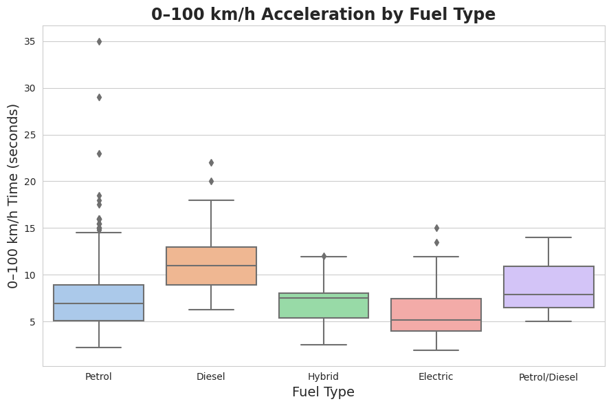

# cars-2025-analysis

# 2025 Automotive Market Data Insights & Visual Analysis

## 📊 Business Value & Project Overview
In a rapidly shifting automotive industry, understanding product positioning, engineering baselines, and powertrain electrification transitions is crucial for automotive manufacturers, dealership networks, and market analysts. 

This project delivers a comprehensive Exploratory Data Analysis (EDA) on a 1,218-vehicle dataset representing the 2025 automotive landscape. By bridging raw performance metrics with market segmentation data, this analysis uncovers how manufacturers differentiate their portfolios and where the industry stands on its evolutionary curve.

---

## 🔍 What I Found (Key Insights)
* **Market Volume Drivers:** The dataset is highly concentrated among major mainstream and high-performance manufacturers. Model availability is led by **Nissan** (149 models), **Volkswagen** (109 models), and **Porsche** (96 models), showcasing distinct strategies between high-volume consumer segments and premium sports segments.
* **The State of Electrification:** Despite global clean-energy shifts, traditional internal combustion engines remain the clear market baseline in this dataset, with **Petrol** accounting for **71.5%** (871 vehicles). However, alternative powertrains have established a critical minority presence, comprising **97 Electric** and **79 Hybrid** models.
* **Performance Baselines:** The typical "average" 2025 vehicle in this fleet generates approximately **307 HP**, achieves a 0–100 km/h acceleration time of **7.5 seconds**, and reaches a top speed of **216 km/h**.
* **The Impact of Extreme Outliers:** While rare, high-end mechanical outliers define the maximum limits of current automotive engineering. The distribution is heavily right-skewed; while the median sits comfortably at **255 HP**, hypercars stretch the absolute boundaries up to a staggering **2,488 HP** and engine capacities up to **16,100 CC**.

---

## 📈 Featured Visualization

*Figure 1: 0-100km/h Acceleration by Fuel Type. This visualization highlights the performance variance across different powertrains, demonstrating how alternative energy vehicles stack up against traditional combustion engines in off-the-line speed.*

---

## 🛠️ Tech Stack
This project leverages the standard Python data science ecosystem to extract, clean, and visualize data:
* **Data Manipulation:** `pandas`, `numpy`
* **Data Visualization:** `matplotlib`, `seaborn`

---

## 🚀 How to View the Project
1. Download the `cars-2025-data-insights-and-visual-analysis.ipynb` file from this repository.
2. Upload it to [Kaggle](https://www.kaggle.com/) or [Google Colab](https://colab.research.google.com/) to run the cells and view the live code.

---

## 🔮 Next Steps & Future Work
To build on these foundations, future iterations of this analysis will focus on:
1. **Predictive Modeling:** Implementing machine learning regression models (e.g., Random Forest, XGBoost) to accurately predict vehicle top speeds and 0–100 km/h times based on structural dimensions and powertrain configurations.
2. **Historical Trend Analysis:** Integrating historical performance data from 2020–2024 to map a five-year time-series trajectory of accelerating EV adoption rates and shifting performance standards.
