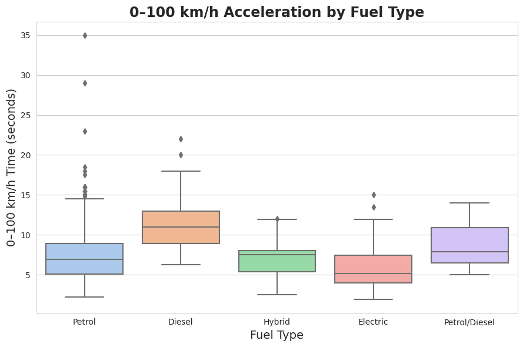

# 2025 Automotive Market: EDA & Feature Engineering

EDA on a 1,218-vehicle 2025 dataset: market concentration, electrification mix, performance baselines, and outlier analysis across manufacturers.

## Headline findings

- **Market volume is concentrated.** Nissan (149 models), Volkswagen (109), and Porsche (96) lead model availability — distinct high-volume-consumer vs. premium-sports strategies.
- **Petrol still dominates.** 71.5% of the fleet (871 vehicles) runs on petrol; Electric (97) and Hybrid (79) hold a real but minority share.
- **Performance baseline:** median vehicle makes ~255 HP (mean 307 HP, skewed by outliers), 0–100 km/h in 7.5s, top speed 216 km/h.
- **Outliers stretch the ceiling.** Hypercars reach up to 2,488 HP and 16,100cc — the right-skewed distribution means the mean overstates a "typical" car.

## Featured visualization

0–100 km/h acceleration spread by fuel type, showing how electric and petrol powertrains compare off the line.

## Stack

- **Python** · pandas, numpy for cleaning and feature extraction (regex-based parsing of mixed-format engine/speed/price fields)
- **matplotlib, seaborn** for visualization

## Reproducing the analysis

1. Download the [Cars Datasets 2025](https://www.kaggle.com/datasets/abdulmalik1518/cars-datasets-2025) CSV from Kaggle (free, just needs a Kaggle account).
2. Either:
   - **Run on Kaggle directly** — upload `cars-2025-data-insights-and-visual-analysis.ipynb` as a new notebook on the dataset page; the data path is already set to Kaggle's default input mount.
   - **Run locally** — place `Cars Datasets 2025.csv` in a `data/` folder at the project root, change the `pd.read_csv(...)` path in the first cell to `data/Cars Datasets 2025.csv`, then `pip install -r requirements.txt` and run the notebook top-to-bottom.

## Next steps

- Predictive modeling (Random Forest / XGBoost) for top speed and 0–100 km/h from structural and powertrain features.
- Historical trend analysis (2020–2024) to track EV adoption and performance shifts over time.
